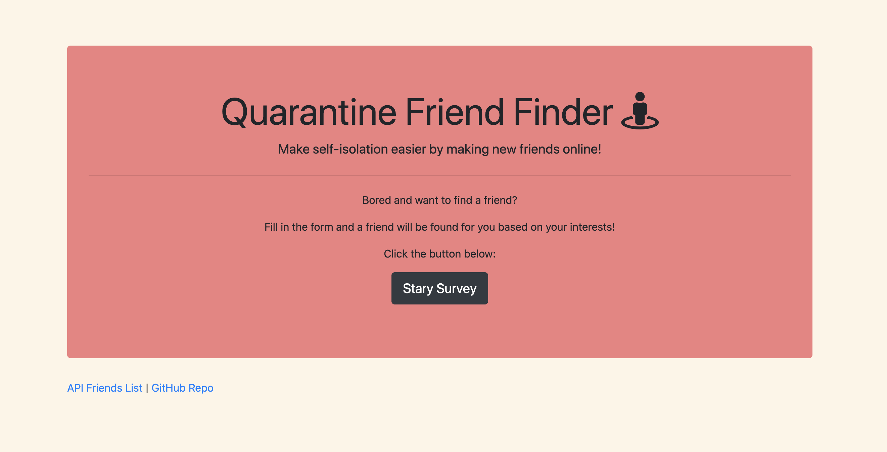
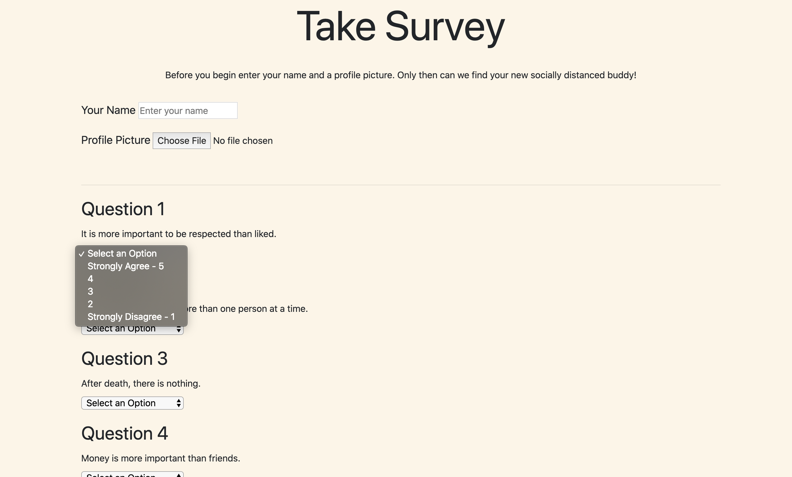

# FriendFinder

For this assignment, this full-stack site will take in results from the users' surveys, then compare their answers with those from other users. The app will then display the name and picture of the user with the best overall match.

## Home Page Image:

## Survey Image

## Technology Used:

- JavaScript
- jQuery
- node.js
- Express.js
- HTML
- Bootstrap

## Heroku Link

https://desolate-bastion-69555.herokuapp.com/

# Issues at due date:

1. The biggest issue I had was getting the modal to work so that it will correctly dispay the users best match.
